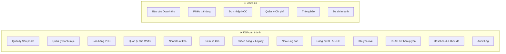

# 🔍 Phân tích & Đề xuất Nghiệp vụ Tiếp theo — TapHoa WMS

## Hiện trạng hệ thống

Hệ thống TapHoa WMS hiện đã có **13 module** hoạt động:



### Phân tích điểm mạnh & điểm yếu

| Mặt | Điểm mạnh ✅ | Điểm thiếu 🔴 |
|---|---|---|
| **Bán hàng** | POS + đơn hàng + thanh toán đa phương thức | Không có **báo cáo doanh thu**, không **xuất hoá đơn**, không **trả hàng/đổi hàng** |
| **Kho** | Nhập/xuất/kiểm kê/batch tracking | Không có **đơn đặt hàng NCC (PO)**, không có **cảnh báo tự động reorder** |
| **Tài chính** | Công nợ KH + NCC | Không có **sổ quỹ**, **chi phí vận hành**, **lãi lỗ** |
| **CRM** | Loyalty points, thông tin KH | Không có **lịch sử mua hàng theo KH**, **phân hạng KH** |
| **Vận hành** | Audit log, RBAC | Không có **thông báo real-time**, **cài đặt hệ thống** |

---

## 🚀 Đề xuất 6 Module nghiệp vụ tiếp theo

### 🥇 Ưu tiên 1 — Báo cáo Doanh thu & Lợi nhuận

> **Lý do**: Đây là tính năng quan trọng nhất còn thiếu. Chủ cửa hàng cần biết **hôm nay bán được bao nhiêu, lãi bao nhiêu**.

#### Tính năng:
- **Doanh thu theo ngày/tuần/tháng/năm** (biểu đồ đường + cột)
- **Top sản phẩm bán chạy** (theo doanh thu + số lượng)
- **Lợi nhuận gộp** = Giá bán - Giá vốn trên mỗi đơn
- **Phân tích theo phương thức thanh toán** (tiền mặt / chuyển khoản / ghi nợ)
- **Phân tích theo nhân viên** (ai bán nhiều nhất)
- **Xuất Excel / PDF** báo cáo

#### Ảnh hưởng backend:
- API mới: `GET /api/v1/reports/revenue?from=...&to=...&groupBy=day|week|month`
- API mới: `GET /api/v1/reports/profit`
- API mới: `GET /api/v1/reports/top-products?limit=10`
- Dữ liệu đã đủ từ `Orders + OrderDetails + Products.CostPrice`

---

### 🥈 Ưu tiên 2 — Phiếu Trả hàng / Đổi hàng (Return/Exchange)

> **Lý do**: Bất kỳ cửa hàng nào cũng cần xử lý trả hàng. Hiện tại chỉ có Cancel order nhưng **không hỗ trợ trả một phần**.

#### Tính năng:
- **Trả hàng từng phần**: chọn từng sản phẩm trong đơn → nhập số lượng trả
- **Hoàn tiền** hoặc **đổi hàng khác**
- **Lý do trả hàng** (lỗi sản phẩm, không vừa ý, hết hạn...)
- **Tự động hoàn kho** khi duyệt phiếu trả
- **Dashboard hiển thị tỷ lệ trả hàng**

#### Entities mới:
```csharp
public class ReturnOrder {
    Guid OriginalOrderId;
    string ReturnCode;        // "RT-001"
    ReturnReason Reason;
    ReturnStatus Status;       // Draft → Approved → Refunded
    decimal RefundAmount;
    List<ReturnOrderLine> Lines;
}
```

---

### 🥉 Ưu tiên 3 — Đơn nhập hàng NCC (Purchase Order)

> **Lý do**: Hiện tại nhập kho là thủ công (`InventoryTransaction`). Cần quy trình chuẩn: **Tạo PO → NCC xác nhận → Nhận hàng → Duyệt → Nhập kho**.

#### Tính năng:
- **Tạo đơn nhập hàng** chọn NCC + sản phẩm + số lượng + giá nhập
- **Theo dõi trạng thái**: Draft → Submitted → Received → Approved
- **Nhận hàng từng phần** (partial delivery)
- **Tự động tạo công nợ NCC** khi duyệt PO
- **So sánh giá nhập** giữa các NCC
- **Lịch sử giá nhập** theo thời gian

#### Entities mới:
```csharp
public class PurchaseOrder {
    Guid SupplierId;
    string POCode;           // "PO-2026-001"
    PurchaseOrderStatus Status;
    DateTime ExpectedDelivery;
    List<PurchaseOrderLine> Lines;
}
```

---

### 🏅 Ưu tiên 4 — Quản lý Chi phí & Sổ Quỹ

> **Lý do**: Cửa hàng có nhiều chi phí ngoài hàng hoá (tiền thuê, điện nước, lương...). Cần theo dõi **thu chi** và **lãi ròng thực tế**.

#### Tính năng:
- **Sổ quỹ tiền mặt**: thu vào (bán hàng, thu nợ) + chi ra (nhập hàng, chi phí)
- **Danh mục chi phí**: Thuê mặt bằng, Điện nước, Lương, Vận chuyển, Khác
- **Báo cáo lãi ròng** = Doanh thu − Giá vốn − Chi phí vận hành
- **Biểu đồ thu chi** theo tháng
- **Hạn mức chi tiêu** cảnh báo khi vượt ngân sách

#### Entities mới:
```csharp
public class Expense {
    string Code;
    ExpenseCategory Category;  // Rent, Utilities, Salary, Transport, Other
    decimal Amount;
    DateTime ExpenseDate;
    string Description;
    PaymentMethod PaymentMethod;
}

public class CashBook {
    CashFlowType Type;  // Income, Expense
    decimal Amount;
    string Source;       // "Order-001", "Expense-001"
    DateTime TransactionDate;
}
```

---

### 🎯 Ưu tiên 5 — Thông báo Hệ thống (Notifications)

> **Lý do**: Nhiều sự kiện quan trọng xảy ra (hàng sắp hết, nợ quá hạn, lô hàng sắp hết hạn) nhưng **không ai biết** trừ khi tự vào kiểm tra.

#### Tính năng:
- **Thông báo real-time** (bell icon trên topbar — hiện đã có UI nhưng chưa có data)
- **Cảnh báo tự động**:
  - 🔴 Hàng dưới ngưỡng tối thiểu
  - 🟡 Lô hàng sắp hết hạn (< 30 ngày)
  - 💰 Khoản nợ quá hạn thanh toán
  - 📦 Kiểm kê có chênh lệch lớn
- **Đánh dấu đã đọc / chưa đọc**
- **Cài đặt ngưỡng cảnh báo** cho từng loại

#### Entities mới:
```csharp
public class Notification {
    Guid? UserId;          // null = broadcast
    NotificationType Type;  // LowStock, ExpiringBatch, OverdueDebt, StockAdjustment
    string Title;
    string Message;
    bool IsRead;
    Guid? ReferenceId;     // Link đến entity liên quan
}
```

---

### 🌟 Ưu tiên 6 — Hỗ trợ đa Chi nhánh

> **Lý do**: Hệ thống hiện đã có `CompanyId` (multi-tenant). Bước tiếp theo là **đa chi nhánh** trong cùng 1 company.

#### Tính năng:
- **Quản lý chi nhánh** (tên, địa chỉ, nhân viên phụ trách)
- **Kho riêng biệt** theo từng chi nhánh
- **Chuyển kho** giữa các chi nhánh
- **Báo cáo doanh thu** theo chi nhánh
- **POS riêng** cho từng chi nhánh

> [!WARNING]
> Module này có độ phức tạp cao nhất — cần refactor nhiều entity để thêm `BranchId`.

---

## 📊 Ma trận ưu tiên

| Module | Giá trị kinh doanh | Độ phức tạp | Thời gian | Đề xuất |
|---|:---:|:---:|:---:|:---:|
| Báo cáo Doanh thu | ⭐⭐⭐⭐⭐ | 🟢 Thấp | 2-3 ngày | **Làm ngay** |
| Phiếu Trả hàng | ⭐⭐⭐⭐ | 🟡 TB | 2-3 ngày | **Làm ngay** |
| Đơn nhập NCC (PO) | ⭐⭐⭐⭐ | 🟡 TB | 3-4 ngày | Tiếp theo |
| Quản lý Chi phí | ⭐⭐⭐ | 🟢 Thấp | 2 ngày | Tiếp theo |
| Thông báo | ⭐⭐⭐ | 🟡 TB | 2 ngày | Tiếp theo |
| Đa chi nhánh | ⭐⭐⭐⭐⭐ | 🔴 Cao | 5-7 ngày | Dài hạn |

---

## ❓ Câu hỏi cần xác nhận

1. **Bạn muốn bắt đầu với module nào?** Tôi khuyến nghị **Báo cáo Doanh thu** vì data đã sẵn có, không cần thêm entity mới.

2. **Phiếu trả hàng**: Có cần hỗ trợ "đổi hàng" (exchange) hay chỉ cần "trả hàng + hoàn tiền" (refund)?

3. **Thông báo**: Có cần push notification (email/SMS) hay chỉ cần in-app notification?

4. **Đa chi nhánh**: Bạn có nhu cầu nhiều chi nhánh trong tương lai gần không?
